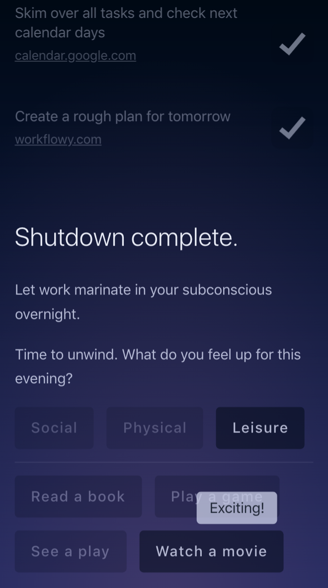

# Jobs Done!

**[Live demo](https://jobs-done.now.sh)** ◌ [Hacker News](https://news.ycombinator.com/item?id=18339215) ◌ [Reddit](https://www.reddit.com/r/productivity/comments/9t8clr/jobs_done_a_ritual_app_for_ending_the_work_day/) ◌ [Product Hunt](https://www.producthunt.com/posts/jobs-done)

Ritual app for ending the work day inspired by [Deep Work](http://calnewport.com/books/deep-work/)

---

Jump to:

- [Motivation](#motivation)
- [How it works](#how-it-works)
- [Tech stack](#tech-stack)
- [How to use](#how-to-use)

## Motivation

Jobs Done! is built on Cal Newport's **shutdown ritual** concept from his book "Deep Work".

The need for a shutdown ritual comes from the following (oversimplified) reasoning:

1.  Deep focus is invaluable for producing great work
2.  We can only sustain deep focus for a limited amount of hours per day
3.  To be able to focus deeply consistently, our mind requires rest (ie. complete disconnect from work) between working sessions

> The app name is inspired by the loyal [Peasant](https://www.youtube.com/watch?v=5r06heQ5HsI)

## How it works

You decide it's time to call it a day.

You are guided through a set of (customizable) steps meant to relieve your mind from work-related thoughts. The steps often involve formalizing thoughts into tasks and creating a plan for tomorrow. Each step can have one more **external links** attached.

Then you **say a "set phrase" out loud.** The set phrase is personal, so choose a phrase you resonate with. Verbalizing your set phrase "provides a simple cue to your mind that it's safe to release work-related thoughts for the rest of the day."

Finally, you're presented a collection of (customizable) pastime activities you can do to disconnect.

> I extended the original shutdown ritual with the last step because I've often found myself clueless about how to spend my evening after a day fully immersed in work.

## Tech stack
_Jobs Done!_ is a [React Native](https://facebook.github.io/react-native/) app built with [React Native for Web](https://github.com/necolas/react-native-web/). For web publishing, _Jobs Done!_ compiles into a static app with the app data embedded in the frontend build.

The project features a [custom server-side rendering implementation](https://github.com/skidding/jobs-done/blob/d3d85ce6c5b156249702d90190397bd67fdc31ed/tools/shared/renderIndex.js#L13-L39), which might be interesting for someone trying to understand how SSR (Server-Side Rendering) works.

Styles are defined _universally_ using [styled-components](https://www.styled-components.com/). Same styles compile to native platforms as well as browsers (on both client and server side). Pretty cool!

## How to use

### Install

Clone this repo and run `yarn install`.

Copy [data.example.js](data.example.js) as `data.js` in project root. Customize it with your info later.

### Run

Run `yarn start` to start the _web_ app locally in dev mode.

Run `yarn cosmos` to browse components independently.

### Publish

Run `yarn build` to create (static) production build.

Go to `build` dir and publish it using something like [Now](https://zeit.co/now) or [Surge](https://surge.sh/).

### Native

The aforementioned instructions are for running and publishing the web app, but this is a React _Native_ project. I did test _Jobs Done!_ on Android and iOS simulator, but I didn't bother publishing it on app stores. The web version works just fine on both desktop and mobile ¯\\\_(ツ)\_/¯.

Open two terminals to load the app on native devices or simulators. In the first run `yarn cosmos:native`. In the second run `yarn start:native` for [Expo](https://expo.io/) or `yarn ios` or `yarn android` for a specific platform.

## License

MIT © [Ovidiu Cherecheș](https://ovidiu.ch)
